# CORS: Problem vs. Solution

## Problem
Browsers enforce the **Same-Origin Policy**, blocking requests from one origin (e.g., `localhost:3000`) to another (e.g., `localhost:8080`) unless explicitly allowed.

```mermaid
sequenceDiagram
    participant F as Frontend (Origin A)
    participant B as Backend (Origin B)

    F->>B: GET /api/data
    Note right of F: Origin: http://localhost:3000
    B-->>F: 200 OK (Payload)
    Note left of B: Headers missing<br/>Access-Control-Allow-Origin
    F->>F: ❌ Browser blocks access<br/>to response data
```



## Resolve
To fix this, the **Server** must include specific headers to "invite" the frontend.

### 1. Simple Requests
Add the origin to the response headers:
```http
Access-Control-Allow-Origin: http://localhost:3000
# OR (for dev only)
Access-Control-Allow-Origin: *
```

### 2. Complex Requests (Preflight)
For custom headers or methods (PUT/DELETE), handle the browser's automatic `OPTIONS` request:
```http
Access-Control-Allow-Methods: GET, POST, PUT, DELETE, OPTIONS
Access-Control-Allow-Headers: Content-Type, Authorization
```
